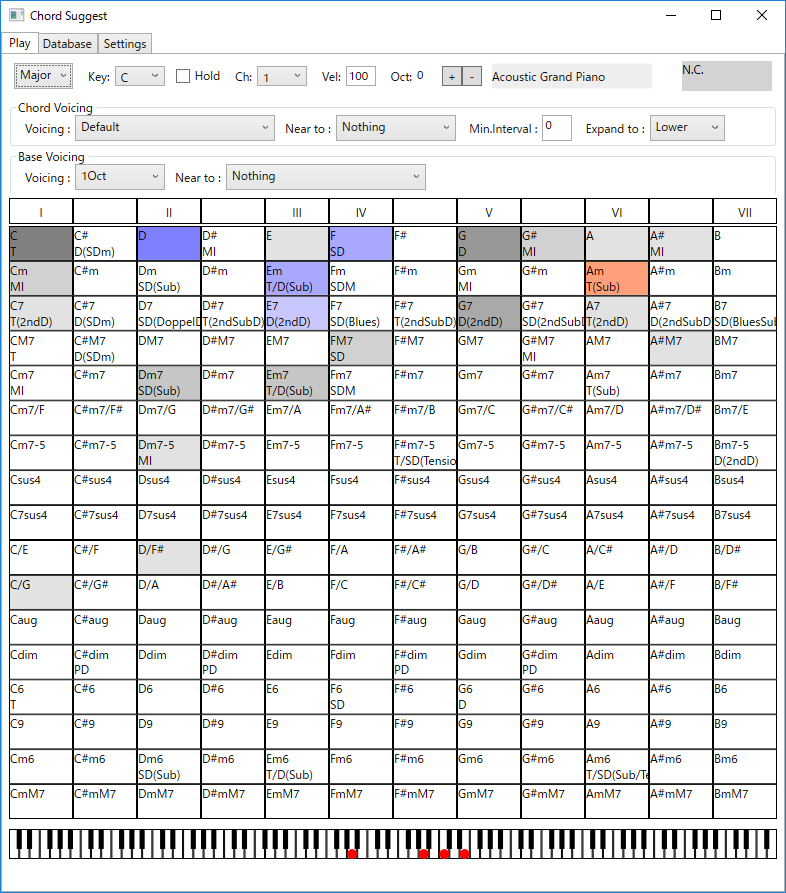

# ChordSuggest
---

コード進行を作成補助ツールです。コード進行の耳コピや作成を補助する橋本直之さまの[Genkhold](http://www6.plala.or.jp/nyk/Genkhord.html)という素晴らしいツールがあるのですが、これを参考に自分のほしい機能を追加したアプリケーションです。

現在のキーでの頻出コードがグレーで、現在なっているコードがレッドで、次に来そうなコードがブルーで表示されます。

ボイシングを変えたり、音声の出力デバイスを調整したり、指定URLからコード進行をスクレイピングしデータベース化するなどの機能が入っています。スクレイピングの機能は悪意ある使い方をすると負荷がかかるので配布版では削除しています。
